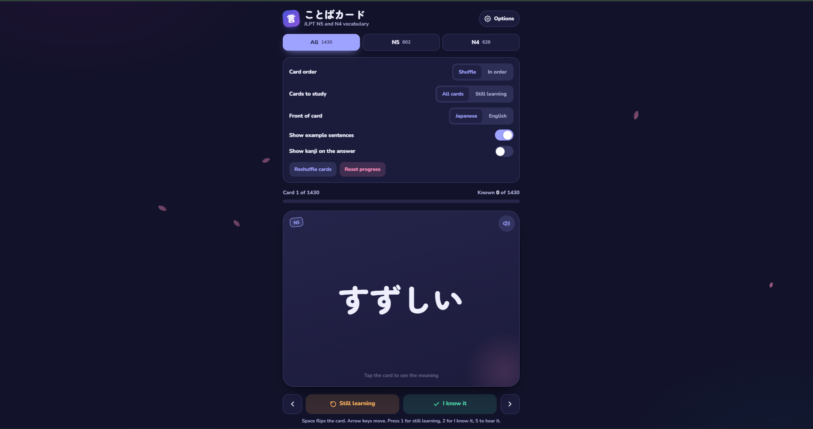

# ことばカード — Kotoba Card

### JLPT N5 & N4 Japanese Vocabulary Flashcards 🇯🇵

**Kotoba Card (ことばカード)** is an interactive Japanese vocabulary
flashcard application designed for learners preparing for the
**JLPT N5 and N4 examinations**.

The app provides a simple and focused way to review Japanese vocabulary
using flashcards, example sentences, pronunciation audio, and learning
progress tracking.

## ✨ Features

- 📚 **JLPT N5 & N4 vocabulary**
- 🃏 Interactive flashcards
- 🇯🇵 Japanese-first learning experience
- 🔤 Japanese ↔ English card orientation
- 🔊 Audio pronunciation
- 💬 Example sentences
- 🈶 Kanji display controls
- 🔀 Shuffle mode
- 📖 Sequential/in-order study mode
- 🧠 "Still Learning" and "I Know It" tracking
- 📊 Learning progress indicator
- 🎯 Study N5 and N4 vocabulary separately
- 🌙 Dark-themed interface
- ⌨️ Keyboard shortcuts for faster studying
- 📱 Responsive interface for different screen sizes

## 📚 Vocabulary

The current vocabulary database contains approximately:

| Level | Words |
|------|------:|
| JLPT N5 | 802 |
| JLPT N4 | 628 |
| **Total** | **1,430** |

The vocabulary is organized into separate N5 and N4 study sets so
learners can focus on the level they are currently preparing for.

> Note: JLPT does not publish a single official fixed vocabulary list.
> The vocabulary included in this application is intended as a study
> resource based on commonly used JLPT preparation materials.

## 🎮 How to Use

1. Select **N5**, **N4**, or **All** vocabulary.
2. Choose your preferred card order:
   - Shuffle
   - In order
3. Choose whether to study:
   - All cards
   - Cards still being learned
4. Select the front of the card:
   - Japanese
   - English
5. Enable or disable:
   - Example sentences
   - Kanji on answers
6. Click a flashcard to reveal its meaning.
7. Mark the word as:
   - **Still Learning**
   - **I Know It**
8. Use the navigation buttons or keyboard shortcuts to continue.

## ⌨️ Keyboard Shortcuts

| Key | Action |
|-----|--------|
| `←` | Previous card |
| `→` | Next card |
| `1` | Mark as Still Learning |
| `2` | Mark as I Know It |
| `S` | Play pronunciation audio |

## 🖥️ Screenshots

### Flashcard Interface



## 🌐 Live Demo

**[Open Kotoba Card](https://YOUR-USERNAME.github.io/kotoba-card/)**

Replace `YOUR-USERNAME` with your GitHub username after deploying the
project.

## 🛠️ Technologies

This project is built using web technologies including:

- HTML5
- CSS3
- JavaScript
- Web Audio / browser audio APIs where applicable

No backend server is required.

## 🚀 Running Locally

Clone the repository:

```bash
git clone https://github.com/YOUR-USERNAME/kotoba-card.git
